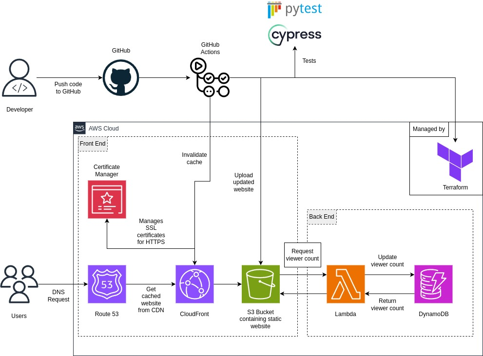

# Cloud Resume

As a project to deepen my knowledge of AWS, I took on the Cloud Resume Challenge [here](https://cloudresumechallenge.dev/docs/the-challenge/aws/), where the goal was to create and deploy a static portfolio website. The main steps of the challenge are:

- Creating a static website using HTML, CSS and JS
- Deploy on S3 and use CloudFront for HTTPS
- Display a visitor counter using DynamoDB
- Infrastructure as Code (IaC) using Terraform
- Set Up CI/CD using GitHub Actions

## Architecture

## Personal Reflections

I'm glad I took on this challenge because it significantly expanded my knowledge in several key areas.

- Practical experience with DevOps practices, including setting up and managing CI/CD pipelines.
- Infrastructure as Code (IaC) using tools like Terraform, which helped me automate and manage cloud infrastructure efficiently.
- Working with AWS services, such as S3, CloudFront, and Route 53, gave me hands-on experience with cloud-based solutions and their integration.
- Deeper understanding of computer networks.

### Website

I built the website using HTML, CSS and JS from scratch, using Bootstrap to assist in some of the components. Unlike others who used plain text only, I wanted to build a clean and modern UI that stands out and inspires.

### Networks

As someone who was completely clueless about networks, this section was a challenge to me. However, this only inspired me to learn more about what DNS, HTTPS and CDNs are.

I registered the domain name using [Namecheap](https://www.namecheap.com/) then set the DNS records in Route 53. As the challenge required HTTPS for security, I used AWS Credentials Manager to store the SSL/TLS certificates. AWS CloudFront was used to cache my website at Edge locations to reduce latency.

### Backend

The backend was implemented using AWS Lambda Function URLs which retrieved the visitor count from DynamoDB and incremented it. The frontend accesses this data by making a GET request to the Lambda Function URL.

### Infrastructure as Code (IaC)

The tool I chose for IaC was [Terraform](https://www.terraform.io/). Terraform allows AWS resources to be configured using code, so that one does not have to click around in the AWS console. This section took the greatest amount of time for me as it was completely new and I had to learn the Terraform tool.

### CI/CD

For CI/CD, I implemented GitHub Actions to automate the deployment process. I configured workflows to automatically build, test, and deploy my code changes. The workflow is as follows:

_Backend Testing -> Apply Terraform Changes -> Deploy to S3 Bucket/Invalidate CloudFront Cache -> Frontend Testing_

### Testing

I utilised Cypress for frontend testing, ensuring that my website functions as intended. For backend testing, I used pytest along with moto, which mocked AWS services, to effectively test my API and simulate interactions with AWS without incurring costs.
